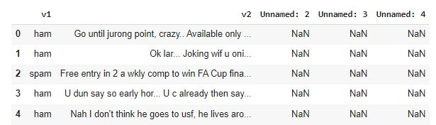
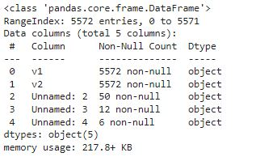
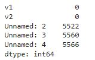
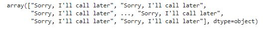
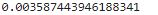

# Implementation-of-SVM-For-Spam-Mail-Detection

## AIM:
To write a program to implement the SVM For Spam Mail Detection.

## Equipments Required:
1. Hardware – PCs
2. Anaconda – Python 3.7 Installation / Moodle-Code Runner

## Algorithm
1. Import the required packages.
2. Import the dataset to operate on.
3. Split the dataset.
4. Predict the required output.
5. End the program.

## Program:
```python
/*
Program to implement the SVM For Spam Mail Detection..
Developed by   : Venkatesh E 
RegisterNumber : 212221230119
*/
import pandas as pd
d=pd.read_csv("spam.csv",encoding='latin-1')

d.head()
d.info()
d.isnull().sum()

x=d["v1"].values
y=d["v2"].values

from sklearn.model_selection import train_test_split
x_train,x_test,y_train,y_test=train_test_split(x,y,test_size=.2,random_state=0)

from sklearn.feature_extraction.text import CountVectorizer 
#CounterVectoriser is a method to convert text to numerical data. The text is transformed to a sparse matrix
cv=CountVectorizer()

x_train=cv.fit_transform(x_train)
x_test=cv.transform(x_test)

from sklearn.svm import SVC 
svc=SVC()
svc.fit(x_train,y_train)
y_pred=svc.predict(x_test)
y_pred

from sklearn import metrics
acc=metrics.accuracy_score(y_test,y_pred)
acc
```

## Output:
### Data Head:

### Data Info:

### Data Isnull:

### Detected Spam:

### Accuracy:

## Result:
Thus the program to implement the SVM For Spam Mail Detection is written and verified using python programming.
